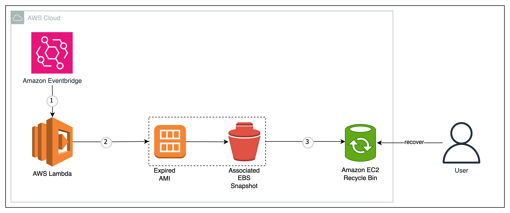

# AMI Deregistration Automation

This project automates the deregistration of Amazon Machine Images (AMIs) and manages their associated EBS snapshots using AWS Lambda, EventBridge, and Recycle Bin services.

## Overview

The solution automatically identifies and deregisters AMIs based on configurable criteria, while safely moving associated snapshots to AWS Recycle Bin for retention before permanent deletion. This helps maintain AWS account hygiene and manage storage costs.

## Architecture



### Components

- **AWS Lambda Function**: Core logic for AMI deregistration and snapshot management
- **EventBridge Rule**: Scheduled trigger (daily execution)
- **IAM Role**: Permissions for Lambda to interact with EC2 and Recycle Bin services
- **CloudWatch Log Group**: Centralized logging for monitoring and debugging
- **Recycle Bin Rules**: Retention policies for deleted AMIs and snapshots

## Features

- Automated daily execution via EventBridge
- Configurable retention periods for deleted resources
- Tag-based resource filtering
- Safe deletion with Recycle Bin integration
- Comprehensive logging and monitoring
- Dry-run capability for testing

## Prerequisites

- AWS CLI configured with appropriate permissions
- Terraform >= 1.0
- Python 3.12 (for Lambda function)

## Deployment

1. **Clone the repository**
   ```bash
   git clone <repository-url>
   cd deregistration-ami
   ```

2. **Configure variables** (optional)
   
   Edit `variables.tf` or create a `terraform.tfvars` file:
   ```hcl
   region = "us-east-1"
   function_name = "my-ami-recycle-lambda"
   resource_tag_key = "Environment"
   resource_tag_value = "Development"
   rbin_retention_period_value = 30
   dry_run = false
   ```

3. **Deploy infrastructure**
   ```bash
   terraform init
   terraform plan
   terraform apply
   ```

## Configuration

### Variables

| Variable | Type | Default | Description |
|----------|------|---------|-------------|
| `region` | string | `us-east-2` | AWS region for deployment |
| `function_name` | string | `ami-recycle-lambda` | Lambda function name |
| `function_description` | string | Function description | Lambda function description |
| `function_runtime` | string | `python3.12` | Lambda runtime version |
| `function_timeout` | number | `15` | Function timeout in seconds |
| `memory_size` | number | `128` | Lambda memory allocation (MB) |
| `resource_tag_key` | string | `Project` | Tag key for resource filtering |
| `resource_tag_value` | string | `Test-Retention` | Tag value for resource filtering |
| `rbin_retention_period_value` | number | `30` | Recycle bin retention period |
| `rbin_retention_period_unit` | string | `DAYS` | Retention period unit |
| `cw_retention_period` | number | `14` | CloudWatch logs retention (days) |
| `dry_run` | bool | `true` | Enable dry-run mode (no actual deletions) |

### Environment Variables

The Lambda function uses these environment variables:

- `RECYCLE_BIN_TAG_KEY`: Tag key for filtering resources
- `RECYCLE_BIN_TAG_VALUE`: Tag value for filtering resources  
- `RBIN_RETENTION_PERIOD_VALUE`: Retention period value
- `RBIN_RETENTION_PERIOD_UNIT`: Retention period unit

## Usage

### Manual Execution

Test the Lambda function manually:
```bash
aws lambda invoke \
  --function-name ami-recycle-lambda \
  --payload '{}' \
  response.json
```

### Monitoring

View logs in CloudWatch:
```bash
aws logs tail /aws/lambda/ami-recycle-lambda --follow
```

### Dry Run Mode

By default, the function runs in dry-run mode (`dry_run = true`). This allows you to:
- Test the logic without making actual changes
- Review which resources would be affected
- Validate tag filtering and selection criteria

Set `dry_run = false` in your configuration to enable actual resource deletion.

## IAM Permissions

The Lambda function requires these permissions:

- **EC2 Permissions**:
  - `ec2:DescribeImages`
  - `ec2:DescribeSnapshots`
  - `ec2:DescribeTags`
  - `ec2:DeregisterImage`
  - `ec2:DeleteSnapshot`
  - `ec2:CreateTags`

- **Recycle Bin Permissions**:
  - `rbin:ListRules`

- **CloudWatch Logs**:
  - `logs:CreateLogGroup`
  - `logs:CreateLogStream`
  - `logs:PutLogEvents`

## Security Considerations

- Resources are filtered by tags to prevent accidental deletion
- Recycle Bin provides safety net for recovery
- IAM role follows principle of least privilege
- CloudWatch logging enables audit trail

## Troubleshooting

### Common Issues

1. **Permission Denied**: Verify IAM role has required permissions
2. **Function Timeout**: Increase timeout value for large AMI inventories
3. **No Resources Found**: Check tag filtering criteria
4. **Recycle Bin Errors**: Ensure Recycle Bin is enabled in the region

### Debugging

Enable detailed logging by checking CloudWatch logs:
```bash
aws logs describe-log-groups --log-group-name-prefix "/aws/lambda/ami-recycle"
```

## Cost Optimization

- Lambda execution costs are minimal (pay-per-invocation)
- Recycle Bin storage incurs standard EBS snapshot pricing
- Regular cleanup reduces long-term storage costs
- Monitor CloudWatch logs retention to manage logging costs

## Cleanup

To remove all resources:
```bash
terraform destroy
```

## Contributing

1. Fork the repository
2. Create a feature branch
3. Make your changes
4. Test thoroughly with dry-run mode
5. Submit a pull request

## License

This project is licensed under the MIT License - see the LICENSE file for details.

## Support

For issues and questions:
- Check CloudWatch logs for error details
- Review AWS service limits and quotas
- Consult AWS documentation for service-specific guidance